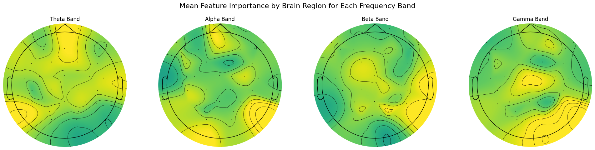
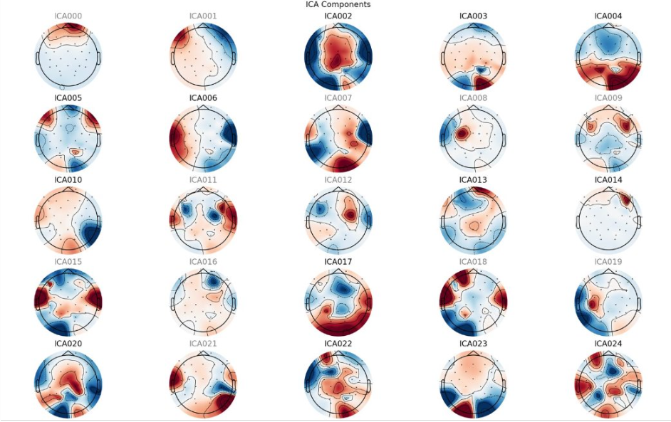
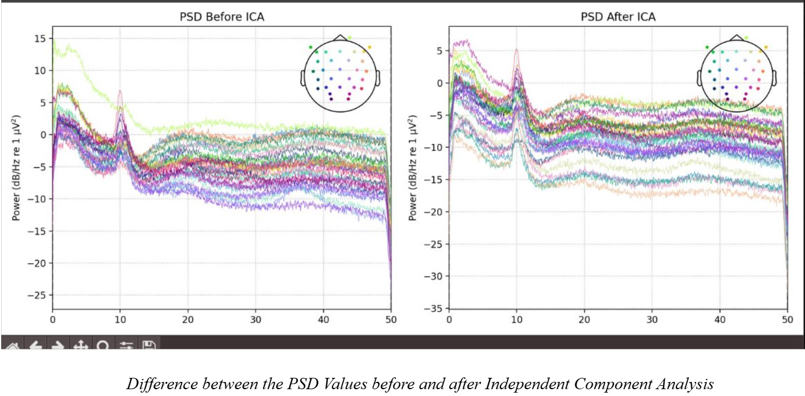

# EEG Signal Driven Deception Recognition Framework 
          

> **A comprehensive EEG preprocessing and meta-analysis pipeline for detecting neural correlates of deception using a competitive two-player game dataset.**

---

## Overview

This repository implements a **full EEG analysis pipeline** from raw BrainVision files to **deception classification** using band power features and Random Forest models. It includes:

- **Advanced preprocessing** with **Artifact Subspace Reconstruction (ASR)** and **ICA with ICLabel**
- **Epoching**, **artifact rejection**, and **bad channel interpolation**
- **Meta-analysis across subjects** with **topographic feature importance visualization**
- **Reproducible, modular, and well-documented code**

---

## Dataset

### **An EEG Dataset of Neural Signatures in a Competitive Two-Player Game Encouraging Deceptive Behavior**  
> **Authors**: Yiyu Chen, Christian Wallraven, Siamac Fazli  
> **Posted**: April 12, 2024  
> **DOI / Link**: [OpenNeuro Dataset](https://figshare.com/articles/dataset/An_EEG_Dataset_of_Neural_Signatures_in_a_Competitive_Two-Player_Game_Encouraging_Deceptive_Behavior/24760827/3)  
> **License**: [CC BY 4.0](https://creativecommons.org/licenses/by/4.0/)

### Key Features
| Attribute | Details |
|--------|---------|
| **Participants** | 12 pairs (24 subjects total) |
| **Task** | Competitive two-player deception game with role switching |
| **EEG System** | 30 EEG channels per player (Brain Products ActiCHamp) |
| **Sampling Rate** | ~500 Hz (downsampled to 100 Hz in preprocessing) |
| **Triggers** | Synchronized behavioral events (decision, feedback) |
| **Data Provided** | Raw `.vhdr/.vmrk/.eeg`, preprocessed `.mat`, and CNN-ready formats |

> This dataset enables **dyadic analysis** of both **deceiver** and **observer** brain activity during real-time social deception.

---

## Pipeline Overview

```mermaid
graph TD
    A[Raw .vhdr Files] --> B[Load + Event Sync]
    B --> C[Downsample to 100 Hz]
    C --> D[Bandpass 1–49 Hz]
    D --> E[Line Noise Removal (50 Hz + harmonics)]
    E --> F[Full-Session ASR (asrpy)]
    F --> G[Bad Channel Detection & Interpolation]
    G --> H[Average Reference]
    H --> I[ICA (Infomax + ICLabel)]
    I --> J[Automatic Artifact Component Rejection]
    J --> K[Epoching: -0.2 to 0.8 s]
    K --> L[Band Power Features (θ, α, β, γ)]
    L --> M[Random Forest Classification]
    M --> N[Meta-Analysis & Topomaps]
```

## Observations & Results

### 1. Topographic Importance Maps per Frequency Band
  
*Gamma and beta show strongest lateralization during deception.*

---

### 2. ICA Components (ICLabel Classified)
  
*Eye blinks, muscle, and cardiac components automatically flagged and removed.*

---

### 3. Power Spectral Density (PSD): Before vs After ICA
  
*High-frequency noise and ocular peaks significantly attenuated.*

---

## Requirements

| Library | Version | Badge |
|---------|---------|-------|
| **Python** | `3.9+` |  |
| **scikit-learn** | `>=1.3` |  |
| **SciPy** | `>=1.10` |  |
| **NumPy** | `>=1.21` |  |
| **Matplotlib** | `>=3.7` |  |
| **Seaborn** | `latest` |  |
| **tqdm** | `latest` |  |
| **pandas** | `latest` |  |

---

### Install with:

```bash
pip install mne mne-icalabel asrpy scikit-learn scipy numpy matplotlib seaborn tqdm pandas